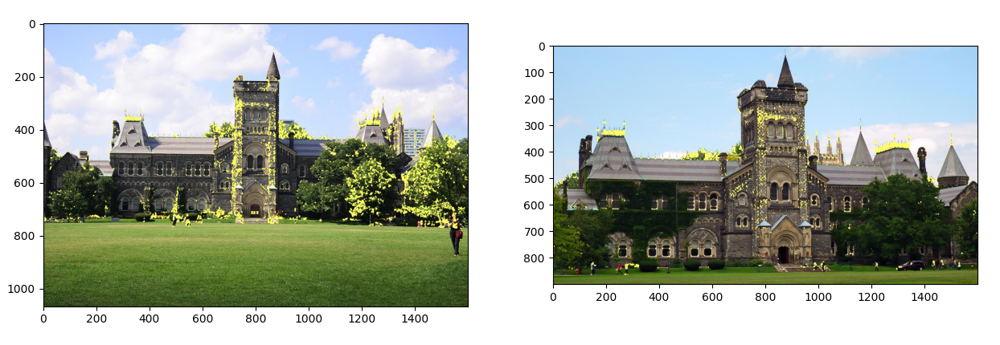

# Histogram of Gradient Feature Descriptor & Harris Corner Detection

This was an assignment to implement a Histogram of Gradient feature descriptor. I used six bins as specified in the assignment. I also calculated the eigen values of the second moment matrix to detect corners on a separate set of images. 

### HOG Visualization 

I used a sample image of my desk with flash on, and visualized the HOG descriptor using both magnitude and occurence for the histogram values. 

Sample Image HOG Feature Descriptor Visualization: 

It can be observed the feature descriptor was somewhat effective in locating features in the image, such as the sanitizer bottle or the monitor arm. Unfortunately, due to the image / screem resolution, you might have to zoom in to see the feature detection. 

### Corner Detection 

I used two images specified, which show the University College building at the University of Toronto from different angles. 

